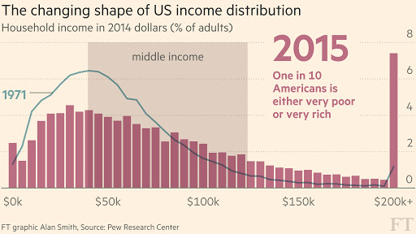

class: title-slide-section-blue, middle, center

# Parametric Distributions and Simulations

##Elad Guttman

---
class: large

# Outline

1. [Normal distribution](#normal)

2. [Log-normal distribution](#log)

3. [Chi-square distribution](#chi)

4. [Student's t-distribution](#t)

5. [F-distribution](#f)

---

class: title-slide-section-blue, middle, center
name: normal

# Normal distribution
---
class: large
# Details


- Support: $(-\infty, \infty)$

- Parameters:

 - $\mu$ - a location parameter
 
 - $\sigma$ - a scale parameter 

- PDF = $\frac{1}{{\sigma \sqrt {2\pi } }} e^{-\frac{1}{2} ({\frac{x-\mu}{\sigma}})^2}$
 
- There is no closed form expression for the CDF

- When $\mu = 0$ and $\sigma = 1$,  it is called the **standard normal**

---
class: large

#Details


- Some useful properties:

  1. If $X \sim \mathcal{N}(\mu,\sigma^2)$ then:
  > $a + bX \sim \mathcal{N}(a + \mu, b^2\sigma^2)$
  
  2. If $X_1 \sim \mathcal{N}(\mu_1 , \sigma_1^2)$ and $X_2 \sim \mathcal{N}(\mu_2 , \sigma_2^2)$ are independent, then:
  > $X_1 + X_2 \sim \mathcal{N}(\mu_1 + \mu_2 , \sigma_1^2 + \sigma_2^2)$
  
  3. If $X$ and $Y$ normally distributed, then: 
  > $Y|X = x \sim \mathcal{N}( \mu_y + \rho \frac{\sigma_y}{\sigma_x}(x - \mu_x) , {\sigma_y}^2 (1 - \rho^2) )$


- Practically, we always look at $\frac{X - \mu}{\sigma} \sim \mathcal{N}(0,1)$

---
 # Exploring the location parameter
 
 How the normal distribution is changed as a function of $\mu$?
 
 Let's simulate some data and explore!
 
 ```{r, message = F, warning = F}
library(tidyverse)
N = 1000
mu = c(0, 3, 6)
df = data.frame(matrix(ncol = 3, nrow = N))
set.seed(2020)
for(i in 1:3){
  df[[i]] = rnorm(N, mean = mu[i], sd = 1)
}
head(df, 3)
 ```
---

# Exploring the location parameter
```{r, message = F, warning = F}
df = df %>% 
  pivot_longer(cols = everything(), names_to = "variable", values_to = "value") 
head(df, 3)
p = ggplot(df, mapping = aes(x = value, color = variable)) + 
  geom_density() +
  scale_color_manual(name = "mu =", labels = as.character(mu), 
                     values = c("blue", "red", "forestgreen")) +
  scale_x_continuous(breaks = seq(-3, 9, 2), name = "x", limits = c(-3, 9)) +
  theme(text = element_text(size=20))
```
 
---
# Exploring the location parameter
```{r, message = F, warning = F, fig.align='center', fig.width=8, fig.height=6}
print(p)
```

---
# Exploring the scale parameter
 
But just before that, let's define our own plotting function:

```{r}
make_plot = function(df, legend.title, legend.labels,
                     limits, breaks,
                     g.colors = c("blue", "red", "forestgreen")){
  res = df %>% 
  pivot_longer(cols = everything(), names_to = "variable", values_to = "value") %>%
  ggplot(df, mapping = aes(x = value, color = variable)) + 
  geom_density() +
  scale_color_manual(name = legend.title, labels = legend.labels, 
                     values = g.colors) +
  scale_x_continuous(breaks = breaks, name = "x", limits = limits) +
  theme(text = element_text(size=20)) 
  return(res)
}
```

---
 # Exploring the scale parameter
 ```{r, message = F, warning = F}
N = 10000
sigma = c(1, 2, 3)
df = data.frame(matrix(ncol = 3, nrow = N))
for(i in 1:3){
  df[[i]] = sigma[i] * rnorm(N, mean = 0, sd = 1)
}

p = make_plot(df, legend.title = "sigma = ", legend.labels =as.character(sigma),
limits = c(-6, 6), breaks = seq(-6, 6, 1))
 ```
---

# Exploring the scale parameter
```{r, message = F, warning = F, fig.align='center', fig.width=8, fig.height=6}
print(p)
```
---

class: title-slide-section-blue, middle, center
name: log

# Log-normal distribution
---
class: large
# Details

- The distribution is widely used in economics, particularly because evidence shows that income is log-normally distributed

- **Definition**: 
> A random variable $X$ is log-normally distributed, i.e. $X \sim Lognormal(\mu,\sigma^2)$, if $\ln(X) \sim \mathcal{N}(\mu, \sigma^2)$

- So basically all the properties of the log-normal distribution are derived from the normal distribution 
  
  - for example: [deriving the PDF of the log-normal distribution from the normal distribution](https://en.wikipedia.org/wiki/Log-normal_distribution#Probability_density_function)

- Note that $\mu$ and $\sigma$ have now lost their meaning as location and scale parameters

---

# Illustration

```{r, message = F, warning = F}
mu = c(0, 0.4, 0.6)
df = data.frame(matrix(ncol = 3, nrow = N))
for(i in 1:3){
  ln_x = rnorm(N, mean = mu[i], sd = 1)
  df[[i]] = exp(ln_x)
}

p = make_plot(df, legend.title = "mu = ", legend.labels = as.character(mu),
              breaks = seq(0, 5, 1), limits = c(0, 5))

```

---
# Illustration
```{r,message = F, warning = F, fig.align='center', fig.width=8, fig.height=6}
print(p)
```

---
```{r pressure, echo=FALSE, out.width = '130%'}

```

---
class:  title-slide-section-blue, middle, center
name: chi

# Chi-square distribution
---
class: large
# Details

- The distribution is widely used in statistics, particularly because in some statistical hypothesis tests, the test statistic follows a chi-square distribution under the null hypothesis. (see: [Chi-squared test](https://en.wikipedia.org/wiki/Chi-squared_test))

- **Definition**: 
> If $Z_1, ..., Z_k$ are independent, standard normal random variables, then the sum of their squares $X = \sum_{i=1}^{k}{Z_i}^2$ follows the chi-squared distribution with $k$ 'degrees of freedom', i.e. $X \sim {\chi_k}^2$

- Some properties arising from the definition:
  - Support: $(0, \infty)$
  - Parameter: $k \in \mathbb{N}$ (a.k.a 'degrees of freedom')

---
class: large
# Details

- Other useful properties:
  1. If $Z_1, ..., Z_k$ are independent, standard normal random variables, then:
  > $\sum_{i=1}^{k}(Z_i - \bar{Z})^2 \sim \chi_{k-1}^2$
  
  2. If $X_1 \sim \chi_{k_1}^2$ and $X_2 \sim \chi_{k_2}^2$ are independent, then:
  > $X_1 + X_2 \sim \chi_{k_1 + k_2}^2$
  
  3. If $X \sim \chi_k^2$ then:
  > $E(X) = k$, $Var(X) = 2k$
  
  4. By the CLT, as $k \rightarrow \infty$, $\chi_k^2 \rightarrow \mathcal{N}(k,\sqrt{2k})$
  
---
# Illustration

```{r, message = F, warning = F}
k = c(5, 20, 50)
df = data.frame(matrix(ncol = 3, nrow = N))
for(i in 1:3){
  df[[i]] = rchisq(N, k[i])
}

p = make_plot(df, legend.title = "k =", legend.labels = as.character(k),
              breaks = seq(0, 100, 20), limits = c(0, 100))

#or alternatively, directly using the definition:
#for(i in 1:3){
#  tmp = rep(0, N)
#  for(j in 1:k[i]){
#    tmp = tmp + rnorm(N, 0, 1)^2
#  }
#  df[[i]] = tmp
#}

```

---
# Illustration
```{r,message = F, warning = F, fig.align='center', fig.width=8, fig.height=6}
print(p)
```

---
class: title-slide-section-blue, middle, center
name: t

# Student's t-distribution

---
class: large
# Details

- The distribution is widely used in statistics, particularly because in many statistical hypothesis tests, the test statistic follows a student's t-distribution under the null hypothesis. (see: [Student's t-test](https://en.wikipedia.org/wiki/Student%27s_t-test))


- **Definition**: 
> If $Z \sim \mathcal{N}(0,1)$ and $X \sim \chi_k^2$ are independent, then: <br>
$\frac{Z}{\sqrt{X/k}} \sim t_k$

- Some properties arising from the definition:
  - Support: $(-\infty, \infty)$
  - Parameter: $k \in \mathbb{N}$ (a.k.a 'degrees of freedom')
  
- Another important property: as $k \rightarrow \infty$, $t_k \rightarrow \mathcal{N}(0,1)$

---

# Illustration

```{r, message = F, warning = F}
k = c(2, 5, 20)
df = data.frame(matrix(ncol = 4, nrow = N))
set.seed(38)
for(i in 1:3){
  df[[i]] = rt(N, k[i])
}
df[,4] = rnorm(N, 0, 1)

p = make_plot(df, legend.title = " ", 
              legend.labels = c("k = 2", "k = 5", "k = 20", "standard normal"),
              breaks = seq(-3, 3, 1), limits = c(-3, 3),
              g.colors = c("blue", "red", "forestgreen", "black"))

```

---
# Illustration
```{r,message = F, warning = F, fig.align='center', fig.width=8, fig.height=6}
print(p)
```

---
class: title-slide-section-blue, middle, center
name: f

# F-distribution

---
class: large

# Details

- The distribution is widely used in statistics, particularly because in some statistical hypothesis tests, the test statistic follows an F distribution under the null hypothesis. (see: [F-test](https://en.wikipedia.org/wiki/F-test))


- **Definition**: 
> If $X_1$ and $X_2$ are two independent chi-squared variables with degrees of freedom parameters $d_1$ and $d_2$, respectively, then: <br><br>
$\frac{X_1 / d_1}{X_2 / d_2} \sim F_{d_1,d_2}$

- Some properties arising from the definition:
  - Support: $(0, \infty)$
  - Parameters: $d_1 \in \mathbb{N}$ and $d_2 \in \mathbb{N}$
  
- Note that when $d_1 = 1$, $\sqrt{\frac{X_1}{X_2 / d_2}} \sim t_{d_2}$

 
